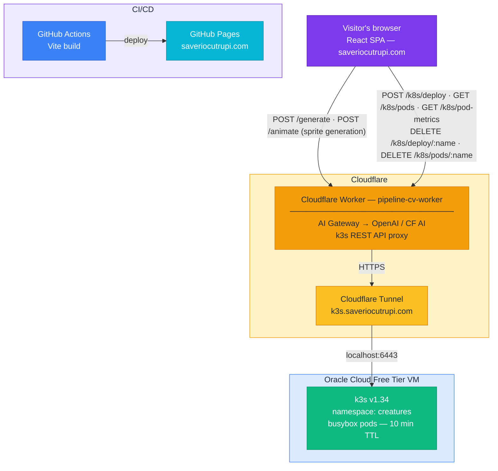

# cv-website

[](https://github.com/SaCut/cv-website/actions/workflows/deploy.yml)

**Live:** [saveriocutrupi.com](https://saveriocutrupi.com)

An interactive CV that doubles as a live platform engineering demo.
The deployment pipeline on the site is not simulated — clicking "Deploy" creates a real Kubernetes pod on an Oracle Cloud VM, visible to anyone who clicks at the same time.

---

## Architecture



**Site delivery:** GitHub Actions builds the Vite app and deploys to GitHub Pages on every push to `main`. The k3s cluster does not host the site.

**Creature deployment:** When a visitor runs the pipeline, the browser calls the Cloudflare Worker, which authenticates against the k3s API through a Cloudflare Tunnel using a scoped service account token. A real `Deployment` is created in the `creatures` namespace. The UI polls every 4 seconds for live pod status, every 10 seconds for real CPU/memory metrics from metrics-server, and shows a **LIVE** badge once pods are running. Visitors can restart individual pods (the ReplicaSet respawns them instantly) or relaunch the whole deployment.

**Orphan prevention:** Three-layer strategy — (1) a Cloudflare Worker cron fires every 10 minutes unconditionally to purge TTL-expired deployments; (2) every pod-status poll piggybacks a background cleanup via `ctx.waitUntil`; (3) the frontend detects a gone deployment (`exists: false` from k8s 404) and auto-resets, clearing sessionStorage.

**Cost:** £0/month — Oracle Cloud free tier VM, Cloudflare Workers free tier, GitHub Pages.

---

## Cost

| Resource | Cost |
|---|---|
| Oracle Cloud VM (free tier — always free) | £0 |
| Cloudflare Workers + Tunnel (free tier) | £0 |
| GitHub Actions + Pages | £0 |
| Terraform | £0 |
| Domain (already owned) | £0 |
| **Total** | **£0/month** |

---

## Repository layout

```
terraform/            IaC for the Oracle Cloud VM (provider, instance, VCN, firewall)
k8s/                  Kubernetes manifests
  creature-rbac.yaml  namespace, ServiceAccount, scoped Role (apps+pods+metrics.k8s.io), token Secret
worker/               Cloudflare Worker (sprite generation + k8s proxy)
  wrangler.toml       cron trigger: */10 * * * * (orphan cleanup)
src/                  React frontend (TypeScript, Three.js)
  components/
    Pipeline.tsx      CI/CD pipeline animation; calls real deploy endpoint
    PodCluster.tsx    Live pod status panel; polls /k8s/pods every 4 s, /k8s/pod-metrics every 10 s
  api.ts              Worker client (deployCreature, getCreaturePods, getCreatureMetrics,
                      teardownCreature, restartPod)
```

---

## Infrastructure

| Component  | Detail                                                                                     |
| ---------- | ------------------------------------------------------------------------------------------ |
| VM         | Oracle Cloud `VM.Standard.E5.Flex`, 1 OCPU / 12 GB, Ubuntu 24.04, uk-london-1              |
| Kubernetes | k3s v1.34.4 + metrics-server (patched `--kubelet-insecure-tls`)                          |
| Tunnel     | `cloudflared` v2026.2.0, systemd service, routes `k3s.saveriocutrupi.com → localhost:6443` |
| Worker     | `pipeline-cv-worker.xartab-mail-flare.workers.dev` — cron every 10 min (orphan cleanup)  |
| RBAC       | SA `creature-manager`, Role scoped to `creatures`: apps/pods/metrics.k8s.io              |

---

## Local dev

```bash
npm install && npm run dev
```

The Worker runs separately:

```bash
cd worker && npm install && npx wrangler dev
```
